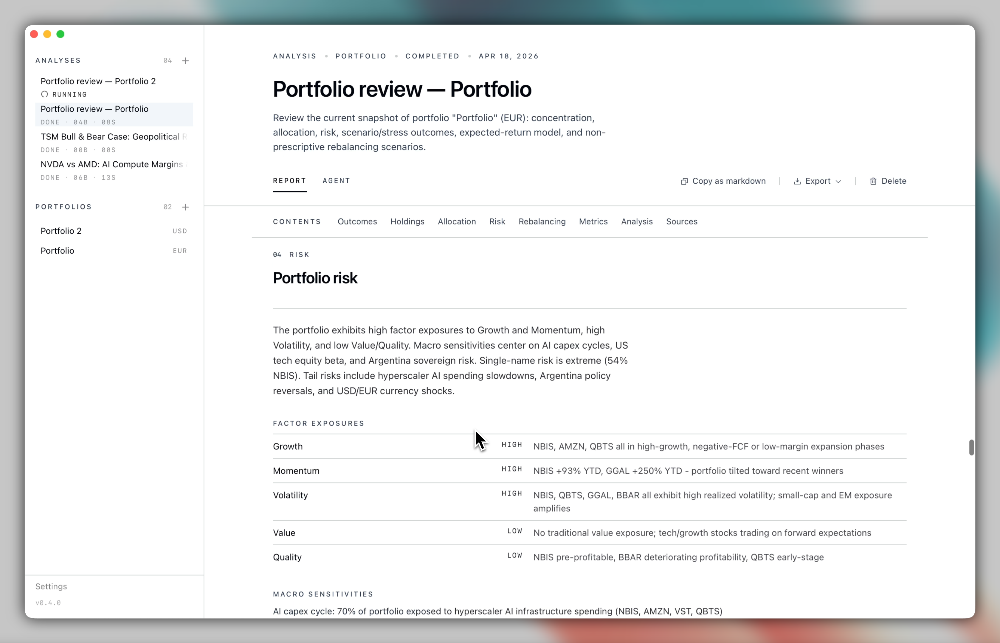

# Bullpen

Stock and portfolio research through coding agents. Reports with sources you can check.

<p align="center">
  
</p>

```bash
brew install --cask puemos/tap/bullpen
```

Or from source: `git clone https://github.com/puemos/bullpen && cd bullpen && cargo run`

---

## How it works

LLM research agents default to one long markdown reply. Bullpen inverts that.

The agent researches freely, but every claim lands as a **source-backed block** — a thesis, a metric, a scenario, a stance — submitted through tools Bullpen controls. The report is assembled from those blocks, not parsed from prose. If a required block is missing or unsourced, finalization fails.

You ask a question or load a portfolio. Pick an agent. Read the report.

---

## Features

- **Thesis and risks** — source links attached
- **Scenarios** — base, upside, downside
- **Final stance** — direction, confidence, what would change it
- **Export** — HTML or Markdown

---

## Portfolios

Create a portfolio, pick a base currency, paste or upload a CSV of your holdings. Bullpen normalizes positions into a local SQLite workspace — holdings, allocation weights, cost basis, 30-day sparklines.

Run a portfolio analysis and the report adds:

- **Holding reviews** — position-by-position research with stance and evidence
- **Allocation breakdown** — by sector, geography, asset class
- **Risk factors** — concentration, correlation, macro sensitivity
- **Rebalancing scenarios** — optional, non-prescriptive, no orders placed

Portfolio data stays local. Bullpen does not connect to brokerages.

<p align="center">
  
  <br/>
  <em>Portfolio risk: factor exposures and macro sensitivities.</em>
</p>

---

## Data sources

12 providers built in. Add an API key per provider in Settings — keys are stored in your OS keychain, never written to disk. Pick which sources to use per run.

| Provider                | Category     |
|-------------------------|--------------|
| Tavily                  | Web search   |
| Brave Search            | Web search   |
| SEC EDGAR               | Filings      |
| Alpha Vantage           | Fundamentals |
| Financial Modeling Prep | Fundamentals |
| Finnhub                 | Fundamentals |
| Polygon                 | Market data  |
| Yahoo Finance           | Market data  |
| NewsAPI                 | News         |
| Finviz                  | Screener     |
| StockTwits              | Forums       |
| Hacker News             | Forums       |

Providers without a configured key are excluded from the agent's tool list.

---

## Local only

No account, no telemetry, no cloud sync. Network calls are your agent's own requests and any data providers you enable. Data stays on your machine.

---

## Screenshots

<p align="center">
  
  <br/>
  <em>Scenarios side by side.</em>
</p>

<p align="center">
  
  <br/>
  <em>Every source the agent cited, in one place.</em>
</p>

<p align="center">
  
  <br/>
  <em>Final stance with reasons and what would change it.</em>
</p>

---

## Agents

Bullpen auto-discovers coding agents on your PATH: Claude Code, Codex, Gemini CLI, Qwen, Mistral, Kimi, OpenCode. You only need one.

Bring your own agent with `BULLPEN_CUSTOM_AGENT` and `BULLPEN_CUSTOM_AGENT_ARGS`.

---

## Development

```bash
cd frontend && pnpm install && pnpm dev   # Vite dev server
cd frontend && pnpm build                  # Type-check + build frontend
cargo run                                  # Run the desktop app
cargo test                                 # Run tests
cargo clippy --all-targets --all-features # Lint
```

Architecture: Rust/Tauri backend, Vite/React frontend, SQLite storage. See [`docs/ARCHITECTURE.md`](docs/ARCHITECTURE.md).

---

## License

MIT or Apache-2.0, at your option.

---

Research tool only. Bullpen does not execute trades, prepare orders, or provide investment advice.
