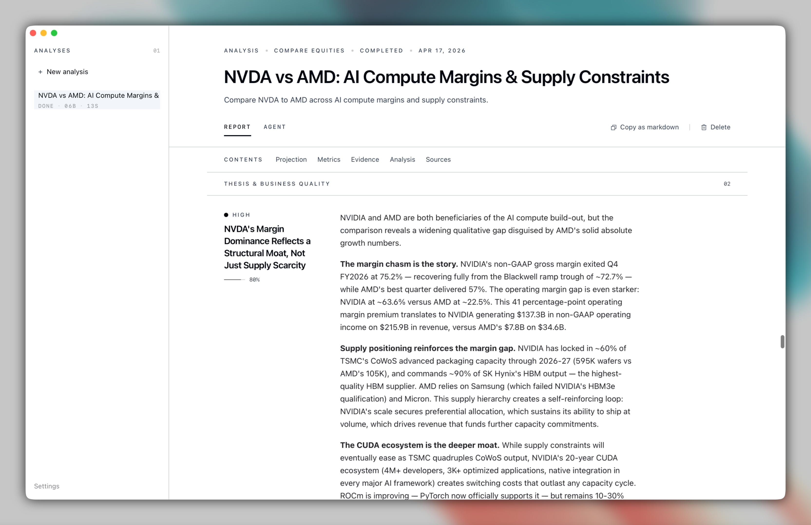

<p align="center">
  <a href="https://bullpen.sh">
    <picture>
      
    </picture>
  </a>
</p>

<h1 align="center">Bullpen</h1>

<p align="center"><b>Stock and portfolio research through coding agents.</b></p>

<p align="center">
  <a href="https://github.com/puemos/bullpen/actions/workflows/ci.yml"></a>
  <a href="https://github.com/puemos/bullpen/releases"></a>
  <a href="LICENSE-MIT"></a>
</p>

[](assets/screenshots/analysis-thesis.png)

---

Bullpen runs your coding agent against a research prompt or portfolio. The agent submits every claim as a source-backed block through tools Bullpen controls. The report is assembled from those blocks, not parsed from prose.

## Features

1. Thesis and risks with source links
2. Scenarios (base, upside, downside)
3. Final stance with confidence
4. Portfolio reviews (holdings, allocation, risk, rebalancing)
5. CSV import for portfolios
6. 12 data providers (SEC EDGAR, Polygon, Finnhub, Alpha Vantage, Yahoo Finance, NewsAPI, etc.)
7. Export to HTML or Markdown
8. Local storage, no account, no telemetry

## Supported Agents

| <br>Claude | <br>Codex | <br>Gemini | <br>Kimi | <br>Mistral | <br>OpenCode | <br>Qwen |
| :---------------------------------------------------------------: | :-------------------------------------------------------------: | :---------------------------------------------------------------: | :-----------------------------------------------------------: | :-----------------------------------------------------------------: | :-------------------------------------------------------------------: | :-----------------------------------------------------------: |

Custom agent: `BULLPEN_CUSTOM_AGENT`, `BULLPEN_CUSTOM_AGENT_ARGS`.

## Installation

### Homebrew (macOS)

```bash
brew install --cask puemos/tap/bullpen
```

### From source

```bash
git clone https://github.com/puemos/bullpen
cd bullpen && cargo run
```

## Data providers

Tavily, Brave Search, SEC EDGAR, Alpha Vantage, Financial Modeling Prep, Finnhub, Polygon, Yahoo Finance, NewsAPI, Finviz, StockTwits, Hacker News.

API keys stored in OS keychain. Providers without keys are excluded.

## Development

```bash
cd frontend && pnpm install && pnpm dev   # dev server
cd frontend && pnpm build                  # build frontend
cargo run                                  # run app
cargo test                                 # tests
cargo clippy --all-targets --all-features # lint
```

See [docs/ARCHITECTURE.md](docs/ARCHITECTURE.md).

## License

MIT or Apache-2.0, at your option.

---

Research tool. Does not execute trades or provide investment advice.
