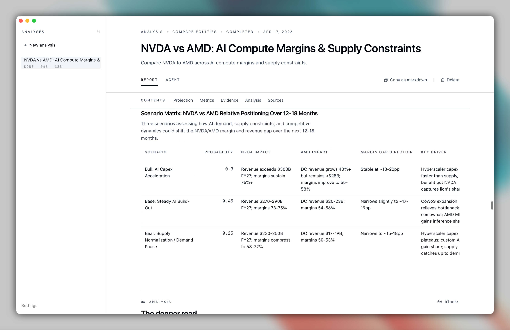
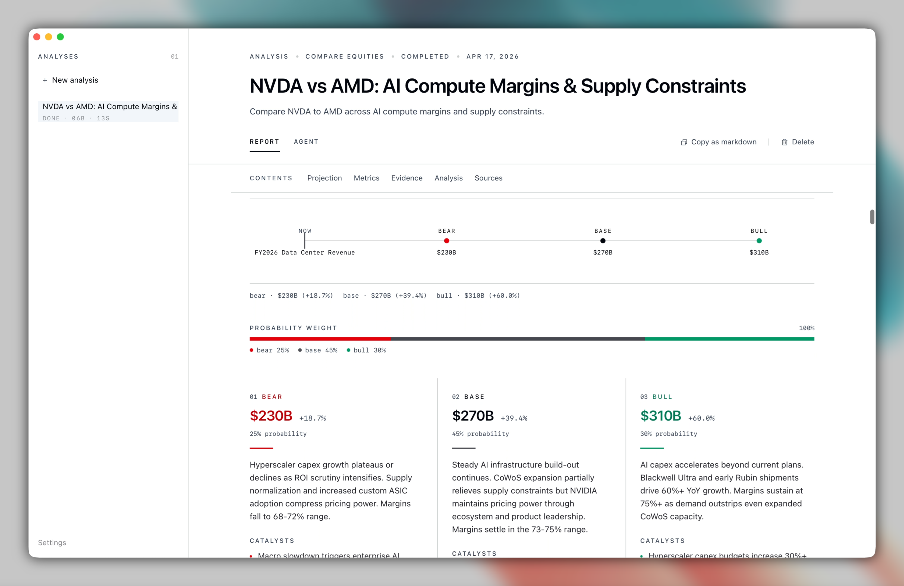
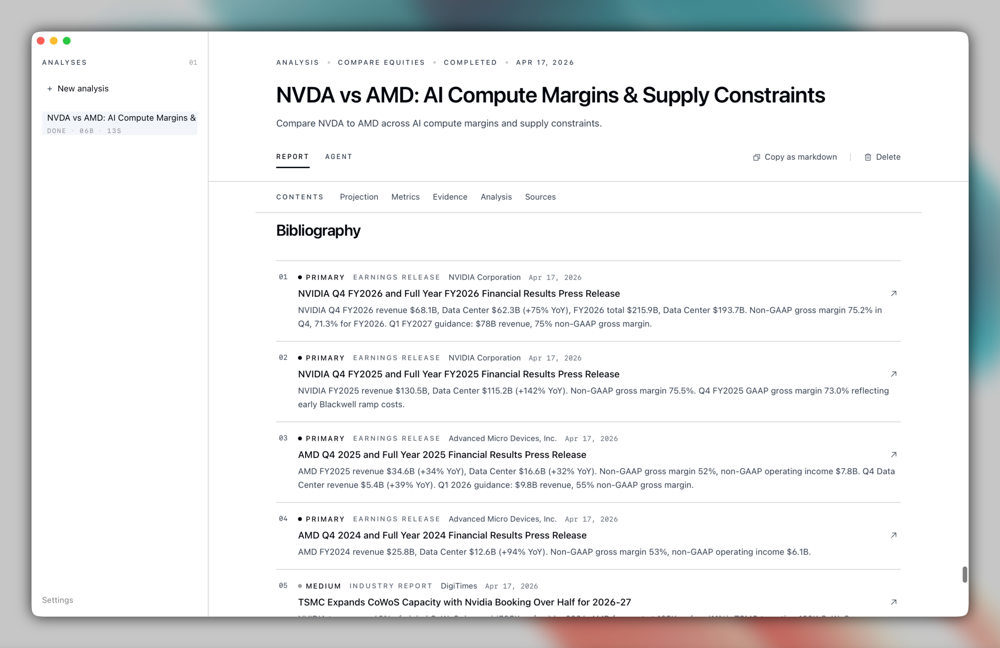
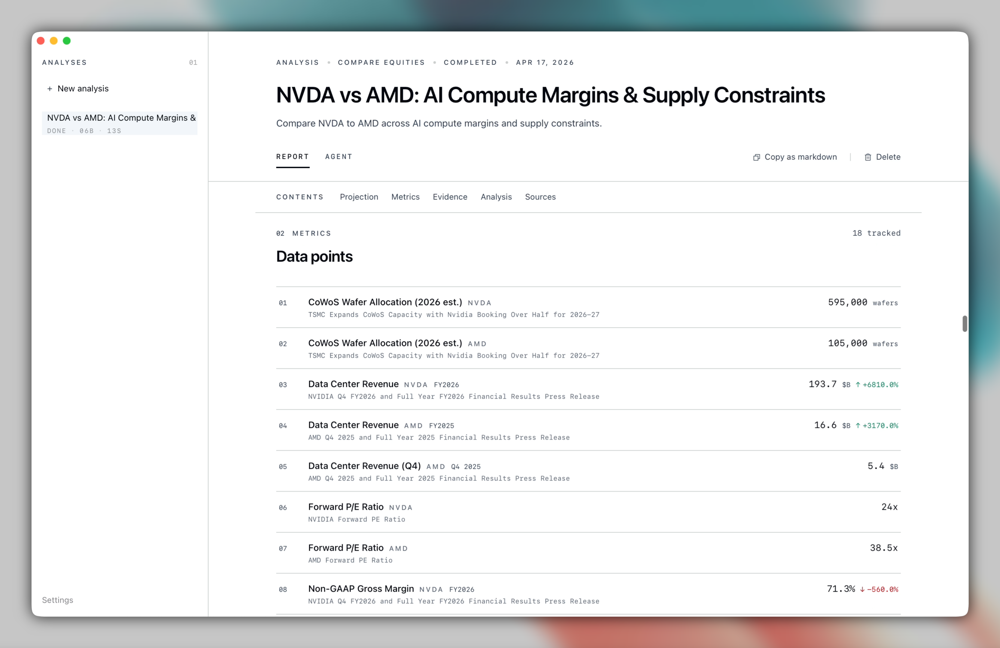
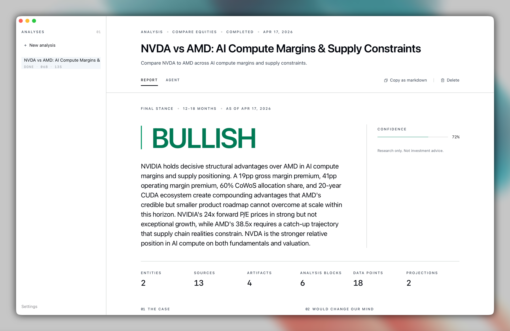

# Bullpen

> Local desktop app for equity and portfolio research through coding agents. Agents research broadly — but submit source-backed blocks through app-owned tools, never a single opaque markdown answer.

[](#license)
[](rust-toolchain.toml)
[](https://tauri.app)
[]()

<p align="center">
  <video src="assets/videos/new-analysis.mp4" width="880" controls></video>
  <br/>
  <em>Prompt or portfolio snapshot → coding agent → tool submissions → final stance, in one run.</em>
</p>

> ⚠️ **Research only.** Bullpen does not execute trades, prepare orders, size positions, or provide personalized investment advice.

---

## Why Bullpen

LLM research agents default to one long markdown reply. Bullpen inverts that: the agent researches freely, but every claim lands as a **source-backed block** — a thesis, a metric, a source, a scenario, a stance, or a portfolio review — submitted through tools Bullpen controls. The report is assembled from those blocks, not parsed from prose.

## How It Works

1. **Ask or load a portfolio** — start from a free-text prompt, or create a portfolio and paste/upload a current holdings snapshot.
2. **Pick a coding agent** — Bullpen starts the agent, passes it the analysis context, and streams the process live.
3. **Agent submits report blocks** — the agent calls Bullpen's `submit_*` tools. Each call is validated and persisted to SQLite as it arrives.
4. **Read the report** — thesis, stance, scenarios, projections, portfolio risks, holding reviews, and every source behind the call.

---

## Quick Start

```bash
# prerequisites: Rust stable (see rust-toolchain.toml), pnpm, Node 20+
git clone https://github.com/puemos/bullpen && cd bullpen
cd frontend && pnpm install && pnpm build && cd ..
cargo run
```

Bullpen auto-discovers supported coding agents on your PATH (Codex, Claude, Gemini, Qwen, Mistral, Kimi, OpenCode).

## Portfolio Workspace

Create a portfolio, choose a base currency, and paste or upload a CSV snapshot of current holdings. Bullpen normalizes positions into a local SQLite workspace with holdings, allocation weights, imported batches, linked analyses, and lightweight 30-day price sparklines.

Portfolio analyses use the same tool flow as single-stock research, but the prompt switches to portfolio intent. The report adds position-by-position holding reviews, allocation breakdowns, portfolio risk, and optional non-prescriptive rebalancing scenarios. Bullpen does not connect to brokerages or place trades.

## Tool Contract

The agent must submit through these tools. Finalization fails unless the checked requirements are met.

| Tool                              | Purpose                                             | Required to finalize          |
| --------------------------------- | --------------------------------------------------- | :---------------------------- |
| `submit_research_plan`            | Up-front plan of attack                             |                               |
| `submit_entity_resolution`        | Disambiguate tickers / entities                     |                               |
| `submit_source`                   | Cite a URL + retrieval context                      | ≥ 1                           |
| `submit_metric_snapshot`          | Structured KPI / metric point                       |                               |
| `submit_analysis_block`           | Thesis, risks, scenarios, etc.                      | thesis + risks, source-backed |
| `submit_holding_review`           | Portfolio position review with stance and evidence  | portfolio runs                |
| `submit_allocation_review`        | Portfolio allocation breakdown by dimension         | portfolio runs                |
| `submit_portfolio_risk`           | Factor, macro, single-name, and tail-risk review    | portfolio runs                |
| `submit_rebalancing_suggestion`   | Optional non-prescriptive scenario rows             |                               |
| `submit_final_stance`             | Rating + confidence                                 | ✓                             |
| `finalize_analysis`               | Seal the run                                        | —                             |

## Agent Configuration

Bullpen discovers coding agents via standard commands. You only need one.

<details>
<summary><strong>Built-in agents</strong> (no config needed if installed)</summary>

- Codex
- Claude
- Gemini / Qwen / Mistral / Kimi
- OpenCode
</details>

<details>
<summary><strong>Override binaries</strong></summary>

Agent-specific override variables are supported for each built-in agent.
</details>

<details>
<summary><strong>Custom agent</strong></summary>

`BULLPEN_CUSTOM_AGENT`, `BULLPEN_CUSTOM_AGENT_ARGS`
</details>

<details>
<summary><strong>Storage</strong></summary>

`BULLPEN_DB_PATH` — defaults to the OS app data directory.
</details>

## Data Sources

Bullpen includes a registry of 12 financial data providers. Add API keys once in Settings — they are stored in your OS native keychain and never written to disk. Keys are redacted from logs.

| Provider                  | Category      |
| ------------------------- | ------------- |
| Tavily                    | Web search    |
| Brave Search              | Web search    |
| SEC EDGAR                 | Filings       |
| Alpha Vantage             | Fundamentals  |
| Financial Modeling Prep   | Fundamentals  |
| Finnhub                   | Fundamentals  |
| Polygon                   | Market data   |
| Yahoo Finance             | Market data   |
| NewsAPI                   | News          |
| StockTwits                | Forums        |
| Finviz                    | Screener      |
| Hacker News               | Forums        |

Providers without a configured key are excluded from the agent's tool list. Use the **RUN SOURCES** button in the research composer to select which sources to activate per run.

## Screens

Portfolio screenshots are intentionally left as placeholders until the final demo data and captures are ready:

- Portfolio workspace after a CSV holdings import.
- Portfolio report with Holdings, Allocation, Risk, and Rebalancing sections.
- Snapshot update flow with paste/upload CSV input and import results.

<p align="center">
  
  
  
  <br/>
  
  
  
</p>

## Development

| Command                                      | Purpose                          |
| -------------------------------------------- | -------------------------------- |
| `cd frontend && pnpm dev`                    | Vite dev server                  |
| `cd frontend && pnpm build`                  | Type-check + build frontend      |
| `cargo run`                                  | Run the Tauri desktop app        |
| `cargo check`                                | Validate Rust compilation        |
| `cargo test`                                 | Run Rust tests                   |
| `cargo fmt`                                  | Format Rust with rustfmt         |
| `cargo clippy --all-targets --all-features`  | Lint                             |

## Architecture

Rust/Tauri backend + Vite/React frontend. Domain types live in `src/domain`, SQLite persistence in `src/infra/db`, agent integration in the infra layer, and Tauri IPC in `src/commands`. See [`docs/ARCHITECTURE.md`](docs/ARCHITECTURE.md).

## License

Licensed under either [MIT](LICENSE-MIT) or [Apache-2.0](LICENSE-APACHE), at your option.
